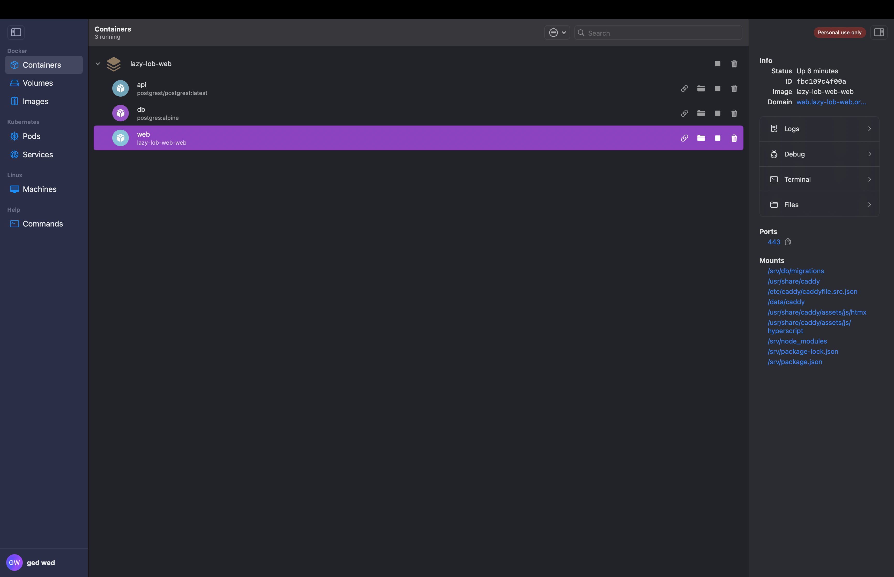
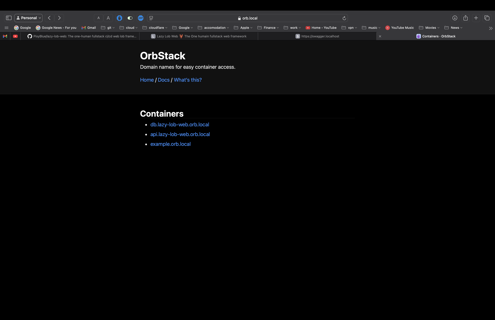

# 🦞 Lazy Lob Web
The One humain fullstack LOB web framework

## Dependencies

- Linux, or, at least, an OS that supports symlinks
- [Git](https://git-scm.com)
- [Docker](https://www.docker.com)
- [Docker compose](https://docs.docker.com/compose/)
- [Just](https://github.com/casey/just)

## What's in the box

- [Caddy](https://caddyserver.com)
- [npm](https://www.npmjs.com)
- [PostgreSQL](https://www.postgresql.org/)
- [Postgrest](https://postgrest.org)
- [SwaggerUI](https://swagger.io)
- [Htmx](https://htmx.org)
- [Hyperscript](https://hyperscript.org)
- [Caddy xtemplate](https://github.com/infogulch/xtemplate-caddy)
- [Caddy Webhooks](https://github.com/WingLim/caddy-webhook)
- [AuthCruch aka Caddy Security](https://authcrunch.com)
- [Lit](https://ajusa.github.io/lit/docs/lit.html)

## Roadmap

- [ ] Sample app
- [ ] Documentation
- [ ] [Caddy Coraza](https://github.com/corazawaf/coraza-caddy)
- [ ] [Caddy upload](https://github.com/git001/caddyv2-upload)?
- [ ] [Caddy Pixbooster](https://github.com/PixyBlue/caddy-pixbooster)
- [ ] [Caddy image processor](https://github.com/quix-labs/caddy-image-processor)

## Documentation

### How to start the demo app

On Linus: 

```bash
git clone https://github.com/PixyBlue/lazy-lob-web.git &&\
  cd lazy-lob-web &&\
  just build boot # wait that all the stuff has started
just init-dev open # type your password when asked to install local SSL certificates for your browser
```

On Mac:

With docker runner as Orb stack ( https://orbstack.dev )


```bash
git clone https://github.com/PixyBlue/lazy-lob-web.git &&\
  cd lazy-lob-web &&\
  just build boot # wait that all the stuff has started
just init # to setup the db.
```





### Just commands
@todo

### Start a new project
@todo

### Write migrations
@todo
